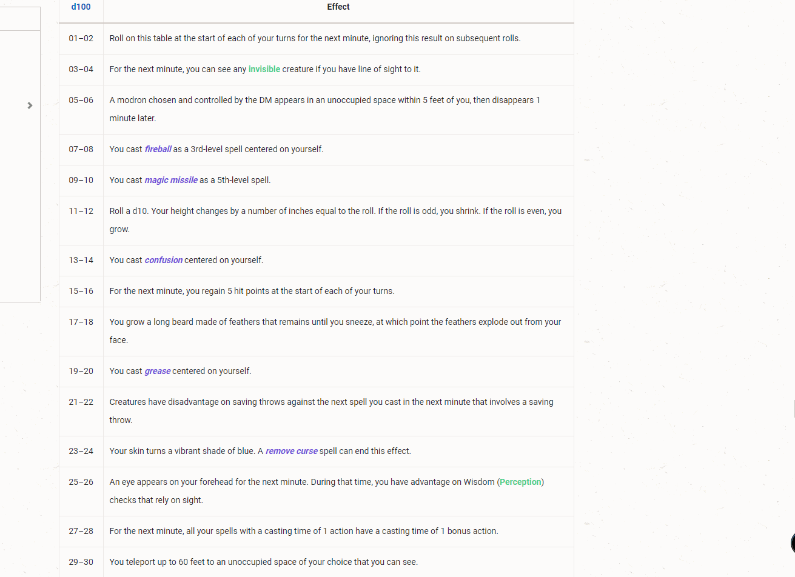

# EasyTable

Simple text-only rollable tables from CSV (or any-SV) data

Useful for populating a table with character names, prefixes for TokenMold or any other textual data.

EasyTable will automatically set the roll formula to 1d{number of entries}, and enable Draw With Replacement and Display To Chat. These can still easily be changed by editing the table

---

## Usage Instructions

### Standard

1. Go to the Rollable Tables tab in FVTT, click the New EasyTable button.
2. Fill in the table title, description(optional) and copy/paste your comma-separated values *
3. Generate!

*You can now weight your table entries with curly braces

eg. `val1,val2{2},val3,val4{4}` will generate a 1d8 table where val2 is selected on a roll of 2 or 3, and val4 is selected on a roll of 5-8

### Alternate

Alternate input is designed to allow you to copy and paste data from tables in digital sourcebooks, or from the web.

As long as the table has the dice roll in column 1 and the value in column 2, you should be able to highlight and copy all of the values to use with EasyTable

1. Go to your Module Settings and enable the alternate input for EasyTable
2. Go to the Rollable Tables tab in FVTT, click the New EasyTable button.
3. Fill in the table title, description(optional) and copy/paste some data from a table (e.g The random misfortunes table on https://www.5esrd.com/spellcasting/alternate-magic-rules/ritual-magic/#Non-Ritual_Casters)
3. Generate!

## Manifest

`https://raw.githubusercontent.com/BlitzKraig/fvtt-EasyTable/master/module.json`

## Feedback

For bugs/feedback, create an issue on GitHub, or contact me on Discord at Blitz#6797

## [Release Notes](./CHANGELOG.md)
